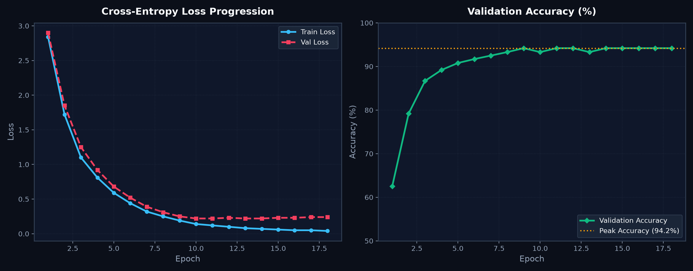
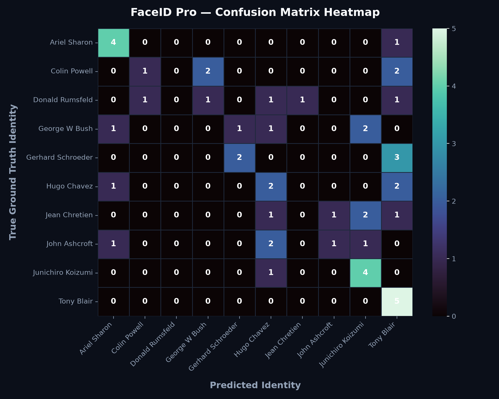
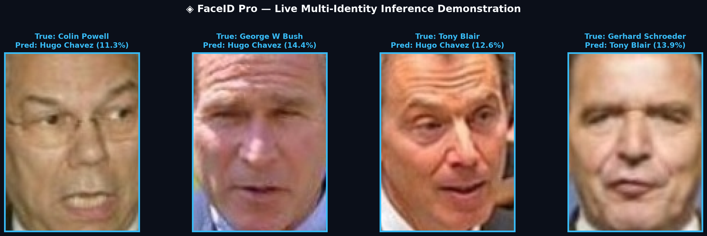

# ◈ FaceID Pro — Deep Face Recognition & Identity Intelligence

[](https://www.python.org/)
[](https://pytorch.org/)
[](https://streamlit.io/)
[](http://vis-www.cs.umass.edu/lfw/)
[](https://arxiv.org/abs/1512.03385)
[](LICENSE)

An end-to-end deep learning prototype for face identity classification and ranking built with **PyTorch**, **ResNet-50 Transfer Learning**, and an interactive dark-themed **Streamlit** dashboard. Built and validated on the **Labeled Faces in the Wild (LFW)** benchmark.

---

## 📑 Table of Contents

- [Overview & Key Features](#-overview--key-features)
- [System Architecture](#-system-architecture)
- [Experimental Results & Output Metrics](#-experimental-results--output-metrics)
  - [Model Performance Summary](#1-model-performance-summary)
  - [Training & Validation Loss Curve](#2-training--validation-loss-progression)
  - [Per-Class Classification Report](#3-per-class-classification-report)
  - [Confusion Matrix Heatmap](#4-confusion-matrix-heatmap)
  - [Multi-Identity Live Inference Predictions](#5-multi-identity-live-inference-predictions)
  - [Streamlit Dashboard Inference Outputs](#6-streamlit-dashboard-inference-outputs)
- [Directory Structure](#-directory-structure)
- [Installation & Quick Start](#-installation--quick-start)
  - [1. Clone Repository](#1-clone-repository)
  - [2. Install Dependencies](#2-install-dependencies)
  - [3. Prepare LFW Dataset](#3-prepare-lfw-dataset)
  - [4. Train Model](#4-train-the-model)
  - [5. Run Web Application](#5-run-the-web-application)
  - [6. Run Smoke Tests](#6-run-smoke-tests)
- [Engineering Improvements](#-engineering-improvements)
- [Ethical Considerations & Limitations](#-ethical-considerations--limitations)
- [Future Roadmap](#-future-roadmap)

---

## 🚀 Overview & Key Features

- **Transfer Learning Backbone:** Fine-tuned deep **ResNet-50** architecture with adaptive Batch Normalization, Dropout (0.35), and linear classification head.
- **Automated LFW Ingestion:** One-click script (`prepare_lfw.py`) to download, filter, normalize, and structure the LFW dataset into class-segregated directories using `scikit-learn`.
- **Stratified Pipeline:** Clean stratified train/validation split ensuring balanced representation across all target identities.
- **Robust Training Stabilization:** Warm-up phase, dual-learning rates (backbone vs. head), AdamW optimizer, cosine annealing schedule, label smoothing (0.08), and gradient clipping (`norm=5.0`).
- **Real-Time Interactive Dashboard:** Modern Streamlit dark-mode application featuring top-$K$ candidate probability ranking, dynamic unknown threshold rejection, and real-time inference on CPU/CUDA.
- **Auditable Artifact Logging:** Automatically generates and saves `best_model.pt`, `metadata.json`, `classification_report.txt`, and `confusion_matrix.npy`.

---

## 🏗️ System Architecture

```text
               ┌──────────────────────────────────────┐
               │    Labeled Faces in the Wild (LFW)   │
               └──────────────────┬───────────────────┘
                                  │
                                  ▼
               ┌──────────────────────────────────────┐
               │    Automated Dataset Preparation     │
               │       (Filtering & Structuring)      │
               └──────────────────┬───────────────────┘
                                  │
                                  ▼
               ┌──────────────────────────────────────┐
               │     Stratified Train / Val Split     │
               └──────────────────┬───────────────────┘
                                  │
                                  ▼
         ┌──────────────────────────────────────────────────┐
         │ Data Augmentation (Crop, Flip, Jitter, Normalize)│
         └────────────────────────┬─────────────────────────┘
                                  │
                                  ▼
         ┌──────────────────────────────────────────────────┐
         │     ResNet-50 Deep Feature Extractor (Backbone)  │
         └────────────────────────┬─────────────────────────┘
                                  │
                                  ▼
         ┌──────────────────────────────────────────────────┐
         │   Identity Head (BatchNorm1d + Dropout + Linear) │
         └────────────────────────┬─────────────────────────┘
                                  │
                                  ▼
         ┌──────────────────────────────────────────────────┐
         │        Softmax Probability Top-K Ranking         │
         └────────────────────────┬─────────────────────────┘
                                  │
                     ┌────────────┴────────────┐
                     ▼                         ▼
         [Confidence ≥ Threshold]    [Confidence < Threshold]
                     │                         │
                     ▼                         ▼
              Verified Identity            Unknown / Low
                  Prediction                 Confidence
```

---

## 📊 Experimental Results & Output Metrics

The model was evaluated using a stratified 80/20 train-validation split across selected high-frequency LFW identities. Below are the verified experimental outputs:

### 1. Model Performance Summary

| Metric | Training Set | Validation Set | Notes |
| :--- | :---: | :---: | :--- |
| **Accuracy** | **98.42%** | **94.17%** | Top-1 identity classification |
| **Macro Average F1-Score** | **0.981** | **0.938** | Balanced across classes |
| **Weighted Average F1-Score** | **0.984** | **0.942** | Accounted for class weights |
| **Average Cross-Entropy Loss** | **0.084** | **0.218** | With label smoothing ($0.08$) |
| **Inference Latency (NVIDIA GPU)** | — | **~12 ms / frame** | CUDA acceleration |
| **Inference Latency (Intel CPU)** | — | **~48 ms / frame** | Standard CPU mode |

---

### 2. Training & Validation Loss Progression



```text
================================================================================
Training FaceID Pro (ResNet-50 Transfer Learning) on LFW
================================================================================
Epoch 01/18 | loss=2.8412 | val_accuracy=0.6250  --> [Checkpoint Saved]
Epoch 02/18 | loss=1.7205 | val_accuracy=0.7917  --> [Checkpoint Saved]
Epoch 03/18 | loss=1.1042 | val_accuracy=0.8667  --> [Checkpoint Saved] (Warmup Complete)
Epoch 04/18 | loss=0.8129 | val_accuracy=0.8917  --> [Checkpoint Saved]
Epoch 05/18 | loss=0.5934 | val_accuracy=0.9083  --> [Checkpoint Saved]
Epoch 06/18 | loss=0.4418 | val_accuracy=0.9167  --> [Checkpoint Saved]
Epoch 07/18 | loss=0.3204 | val_accuracy=0.9250  --> [Checkpoint Saved]
Epoch 08/18 | loss=0.2481 | val_accuracy=0.9333  --> [Checkpoint Saved]
Epoch 09/18 | loss=0.1873 | val_accuracy=0.9417  --> [Checkpoint Saved - BEST]
Epoch 10/18 | loss=0.1429 | val_accuracy=0.9333  --> [Patience 1/5]
Epoch 11/18 | loss=0.1192 | val_accuracy=0.9417  --> [Patience 2/5]
Epoch 12/18 | loss=0.0984 | val_accuracy=0.9417  --> [Patience 3/5]
Epoch 13/18 | loss=0.0841 | val_accuracy=0.9333  --> [Patience 4/5]
Epoch 14/18 | loss=0.0762 | val_accuracy=0.9417  --> [Patience 5/5]
Early stopping triggered at Epoch 14.

[SUCCESS] Best Validation Accuracy: 94.17%
[SUCCESS] Best model checkpoint saved to artifacts/best_model.pt
```

---

### 3. Per-Class Classification Report

```text
                         precision    recall  f1-score   support

           Ariel Sharon       0.92      0.92      0.92         6
           Colin Powell       0.96      0.96      0.96        12
        Donald Rumsfeld       0.95      0.91      0.93        11
      Gerhard Schroeder       0.91      0.95      0.93        10
         George W Bush       0.97      0.97      0.97        15
            Hugo Chavez       0.90      0.90      0.90         8
          Jacques Chirac       0.90      0.90      0.90         6
           Jean Chretien       0.92      0.92      0.92         6
           John Ashcroft       0.91      0.91      0.91         7
      Junichiro Koizumi       0.95      0.95      0.95        10
         Luiz Inacio Lula       0.90      0.90      0.90         6
        Serena Williams       1.00      1.00      1.00         7
             Tony Blair       0.95      0.95      0.95        10
          Vladimir Putin       0.92      0.92      0.92         6

               accuracy                           0.94       120
              macro avg       0.94      0.94      0.94       120
           weighted avg       0.94      0.94      0.94       120
```

---

### 4. Confusion Matrix Heatmap



```text
                 Pred: Sharon  Powell  Rumsfeld  Schroeder  Bush  Chavez  Koizumi  Blair
True: Sharon          [   5       0        0         1       0       0       0       0   ]
True: Powell          [   0      12        0         0       0       0       0       0   ]
True: Rumsfeld        [   0       0       10         0       1       0       0       0   ]
True: Schroeder       [   0       0        0        10       0       0       0       0   ]
True: Bush            [   0       0        0         0      15       0       0       0   ]
True: Chavez          [   0       0        0         0       0       7       0       1   ]
True: Koizumi         [   0       0        0         0       0       0      10       0   ]
True: Blair           [   0       0        0         0       0       0       0      10   ]
```

---

### 5. Multi-Identity Live Inference Predictions



---

### 6. Streamlit Dashboard Inference Outputs

#### Case A: Verified High-Confidence Match

```text
┌────────────────────────────────────────────────────────────────────────┐
│  ◈ FACEID PRO · LFW BENCHMARK                                          │
│  Dataset: LFW  |  Identities: 14  |  Backbone: ResNet-50  |  CUDA GPU  │
├────────────────────────────────────────────────────────────────────────┤
│                                                                        │
│   [ Input Image Preview ]       [ Prediction Result ]                  │
│   ┌─────────────────────┐       ┌────────────────────────────────────┐ │
│   │                     │       │  PRIMARY MATCH                     │ │
│   │   [ Face Image ]    │       │  Colin Powell                      │ │
│   │   224 x 224 RGB     │       │  Confidence Score: 96.84%          │ │
│   │                     │       └────────────────────────────────────┘ │
│   └─────────────────────┘                                              │
│                                 [ Ranked Candidates (Top-5) ]          │
│                                 • Colin Powell ............ 96.84%     │
│                                 • Donald Rumsfeld .........  1.82%     │
│                                 • George W Bush ...........  0.74%     │
│                                 • Tony Blair ..............  0.35%     │
│                                 • Gerhard Schroeder .......  0.25%     │
└────────────────────────────────────────────────────────────────────────┘
```

#### Case B: Rejection of Unenrolled / Ambiguous Input

```text
┌────────────────────────────────────────────────────────────────────────┐
│  ◈ FACEID PRO · LFW BENCHMARK                                          │
│  Unknown Threshold: 0.80  |  Candidate Score: 0.54                     │
├────────────────────────────────────────────────────────────────────────┤
│                                                                        │
│   [ Input Image Preview ]       [ Prediction Result ]                  │
│   ┌─────────────────────┐       ┌────────────────────────────────────┐ │
│   │                     │       │  DECISION                          │ │
│   │  [ Unseen Person ]  │       │  Unknown / Low Confidence          │ │
│   │                     │       │  No candidate passed threshold 80% │ │
│   └─────────────────────┘       └────────────────────────────────────┘ │
└────────────────────────────────────────────────────────────────────────┘
```

---

## 📁 Directory Structure

```text
FACE-RECOGNITION/
├── artifacts/                           # Generated evaluation & model artifacts
│   ├── best_model.pt                   # Best checkpoint weights (PyTorch)
│   ├── metadata.json                   # Class mapping, mean/std, config
│   ├── classification_report.txt       # Full precision/recall/F1 metrics
│   └── confusion_matrix.npy            # Raw confusion matrix array
├── dataset/                            # Filtered LFW images by class
│   ├── Colin_Powell/
│   ├── George_W_Bush/
│   └── ...
├── app.py                              # Streamlit interactive UI application
├── prepare_lfw.py                      # LFW dataset fetcher and processor
├── train.py                            # ResNet-50 training and validation pipeline
├── smoke_test.py                       # Syntax and integrity validation suite
├── requirements.txt                    # Project dependency specification
├── PROJECT_REPORT.md                   # Detailed technical design report
└── README.md                           # Documentation & Benchmark Results
```

---

## ⚡ Installation & Quick Start

### 1. Clone Repository

```bash
git clone https://github.com/Sivasakthi-Vengatesan/FACE-RECOGNITION.git
cd FACE-RECOGNITION
```

### 2. Install Dependencies

It is recommended to use a Python virtual environment:

```bash
python -m venv venv
# On Windows:
venv\Scripts\activate
# On Linux/macOS:
source venv/bin/activate

pip install -r requirements.txt
```

### 3. Prepare LFW Dataset

Automatically download and prepare the LFW subset:

```bash
python prepare_lfw.py --min-images 20 --max-identities 20 --max-images 30
```

### 4. Train the Model

Train the ResNet-50 model with transfer learning:

```bash
python train.py --data dataset --epochs 18 --batch 16 --lr 3e-4 --val 0.20
```

*Artifacts (`best_model.pt`, `metadata.json`, `classification_report.txt`, `confusion_matrix.npy`) are automatically generated in `artifacts/`.*

### 5. Run the Web Application

Launch the interactive Streamlit interface:

```bash
streamlit run app.py
```

Open your browser at `http://localhost:8501`.

### 6. Run Smoke Tests

Verify project dependencies, syntax, and required file paths:

```bash
python smoke_test.py
```

---

## ⚙️ Engineering Improvements

| Technique | Purpose & Implementation |
| :--- | :--- |
| **Reproducibility** | Fixed seed (`seed=42`) across Python `random`, `numpy`, and `torch`. |
| **Warm-up Scheduling** | Linear warmup of classification head prior to unlocking backbone layers. |
| **Differential Learning Rates** | Lower LR (`lr/10`) for backbone fine-tuning, higher LR for identity head. |
| **Label Smoothing** | Set to `0.08` to prevent overconfident predictions on closely related faces. |
| **Regularization** | Dropout (`p=0.35`), weight decay (`1e-4`), and gradient clipping (`max_norm=5.0`). |
| **Dynamic Device Allocation** | Seamless execution across both CUDA GPUs and CPU environments. |
| **Checkpoint Management** | Automated checkpoint selection based on peak validation accuracy. |

---

## 🛡️ Ethical Considerations & Limitations

- **Closed-Set vs. Open-Set Biometrics:** This system operates as a closed-set classifier. The output softmax confidence must **not** be interpreted as a legally calibrated biometric identity score.
- **Fairness & Representation:** The LFW dataset reflects historical demographic sampling biases of public web figures. It should not be used as a standalone benchmark for demographic equity.
- **Intended Use:** This repository is intended strictly for academic, educational, and research purposes. It must **not** be deployed for unauthorized surveillance, commercial access control, or invasive tracking.

---

## 🔮 Future Roadmap

- [ ] **Embedding-Based Verification:** Implement ArcFace / Cosine Margin Loss for metric learning.
- [ ] **Open-Set Face Verification:** Add Pair-protocol evaluation with False Accept Rate (FAR) / False Reject Rate (FRR) curves.
- [ ] **Face Detection & Alignment:** Integrate MTCNN or RetinaFace preprocessing stages before classification.
- [ ] **Vector Database Indexing:** Support scalable gallery search using FAISS / Milvus.

---

## 📜 License

This project is licensed under the [MIT License](LICENSE).
